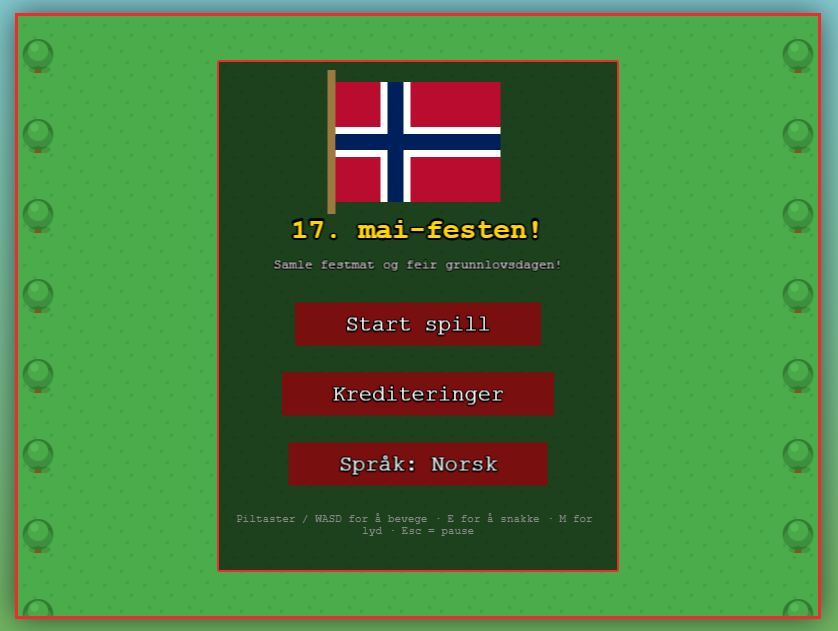
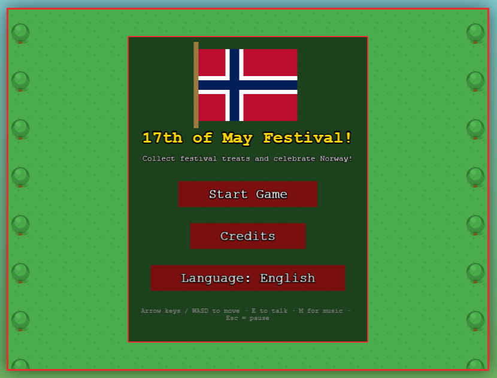
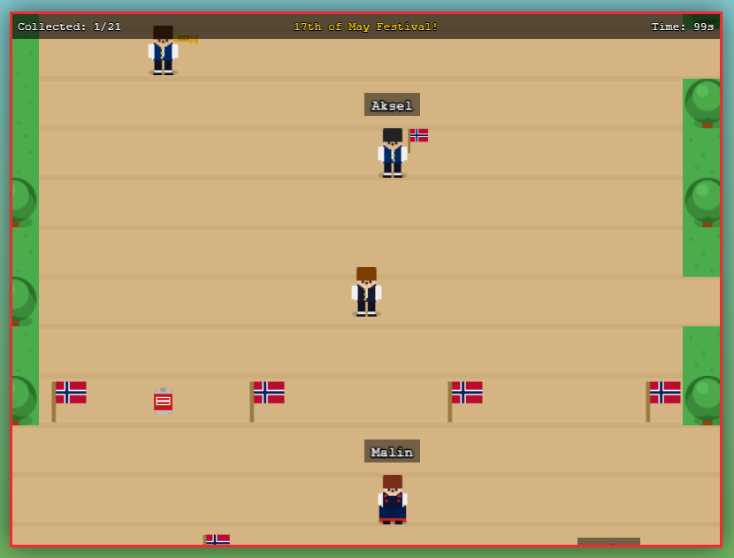

# 17. mai-festen!

A small browser game for Norway's Constitution Day. Walk around a festive park, collect hot dogs, soda, ice cream, balloons, and flags - and talk to the locals. Available in Norwegian and English. **[Play it here](https://kjetilberg-labs.github.io/17mai-festen/)**

## Screenshots

<table>
  <tr>
    <td align="center"><b>Norwegian</b></td>
    <td align="center"><b>English</b></td>
  </tr>
  <tr>
    <td></td>
    <td></td>
    <td></td>
  </tr>
</table>


## Controls

| Key | Action |
|-----|--------|
| Arrow keys / WASD | Move |
| E | Talk to NPCs |
| M | Toggle music |
| Esc | Pause |


## Tech

- [Phaser 3](https://phaser.io/) - game framework
- All graphics generated procedurally in JavaScript - no external assets
- Music: *Gammel Jegermarsj* (traditional Norwegian march)

---

## Running locally

Open `index.html` directly in a browser, or serve with any static file server:

```bash
npx serve .
python -m http.server
```

---

*Gratulerer med dagen!*

## License
All rights reserved. No copying, sharing, or reuse without permission. Contact me if you're interested in using any part of this project.
